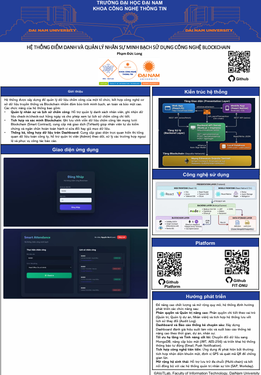

# ⛓ Chamcong Blockchain — Hệ thống Quản lý Chấm Công Blockchain

---

## 📋 Giới thiệu đề tài

Hệ thống quản lý chấm công thông minh ứng dụng công nghệ **Blockchain Ethereum**, cho phép:

- 👥 **Nhân viên** chấm công trực tuyến qua web/mobile app
- 📊 **Quản lý** theo dõi và thống kê chấm công realtime
- ⛓ **Blockchain** lưu trữ dữ liệu chấm công **vĩnh viễn, bất biến, minh bạch**
- 🔍 **Bất kỳ ai** có thể tra cứu và xác minh qua Etherscan

> ⚠️ **Điểm khác biệt cốt lõi**: Dữ liệu chấm công được ghi lên Blockchain — không ai có thể chỉnh sửa hay xóa bỏ, đảm bảo tính toàn vẹn và công bằng tuyệt đối.

---

## 🏗️ Kiến trúc hệ thống

```
┌─────────────────────────────────────────────────────────┐
│                    FRONTEND LAYER                       │
│      Web UI (React)  │  Mobile App  │  Dashboard        │
│              HTML + CSS + JavaScript                    │
└─────────────────────┬───────────────────────────────────┘
                      │ HTTP REST API
┌─────────────────────▼───────────────────────────────────┐
│                    BACKEND LAYER                        │
│              Node.js + Express.js                       │
│         routes/attendance.js  │  routes/stats.js        │
│              (Mock Data + Blockchain Ready)             │
└─────────────────────┬───────────────────────────────────┘
                      │ Ethers.js v6
┌─────────────────────▼───────────────────────────────────┐
│                  BLOCKCHAIN LAYER                       │
│           Ethereum Sepolia Testnet                      │
│         Attendance.sol (Smart Contract)                 │
│         (Bất biến — Minh bạch — Phi tập trung)         │
└─────────────────────────────────────────────────────────┘
```

---

## 🛠️ Công nghệ sử dụng

| Công nghệ | Phiên bản | Vai trò |
|---|---|---|
| **Solidity** | 0.8.19 | Viết Smart Contract Attendance |
| **Ethers.js** | 6.16.0 | Kết nối JS với Blockchain |
| **Node.js** | 18.x+ LTS | Môi trường Backend |
| **Express.js** | 5.2.x | REST API Server |
| **React.js** | Vite | Frontend Web UI |
| **React Native** | Expo | Mobile App (iOS/Android) |
| **Ethereum Sepolia** | Testnet | Mạng Blockchain thử nghiệm |
| **Chart.js** | 4.x | Biểu đồ thống kê |
| **CORS** | 2.8.6 | Xử lý Cross-Origin requests |

---

## 📁 Cấu trúc dự án

```
chamcong_blockchain/
├── Attendance.sol          ← Smart Contract quản lý chấm công
├── convert.js              ← Script chuyển đổi dữ liệu
│
├── frontend/
│   ├── src/
│   │   ├── App.jsx         ← React App component
│   │   ├── index.css
│   │   └── assets/
│   ├── index.html
│   ├── vite.config.js
│   ├── eslint.config.js
│   ├── package.json
│   └── README.md
│
├── backend/
│   ├── index.js            ← Express server (port 5000)
│   ├── data.json           ← Mock data lưu trữ
│   ├── users.json          ← Dữ liệu user
│   ├── package.json
│   └── routes/
│       ├── attendance.js   ← API chấm công
│       └── stats.js        ← API thống kê
│
├── mobile/
│   ├── App.js              ← React Native main
│   ├── index.js
│   ├── app.json
│   ├── babel.config.js
│   ├── metro.config.js
│   ├── package.json
│   └── assets/
│
├── update_docx.py          ← Script Python (utility)
├── run_guide.md            ← Hướng dẫn chạy dự án
└── package.json
```

---

## ⚙️ Hướng dẫn cài đặt và chạy

### Yêu cầu hệ thống

- **Node.js** v18+ ([tải tại đây](https://nodejs.org))
- **Git** (tùy chọn)
- **MetaMask** extension ([cài tại đây](https://metamask.io)) - để deploy/test blockchain

### Bước 1 — Clone/Download dự án

```bash
# Nếu dùng Git
git clone https://github.com/your-username/chamcong-blockchain.git
cd chamcong-blockchain

# Hoặc extract file ZIP vào thư mục dự án
```

### Bước 2 — Cài đặt dependencies chung (nếu cần)

```bash
npm install
```

### Bước 3 — Chạy Backend (API Server)

```bash
cd backend
npm install
npm run dev
```

✅ Backend sẽ chạy tại: `http://localhost:5000`

### Bước 4 — Chạy Frontend (Web UI) - Mở terminal mới

```bash
cd frontend
npm install
npm run dev
```

✅ Frontend sẽ chạy tại: `http://localhost:5173` (hoặc port khác nếu 5173 đã sử dụng)

### Bước 5 — Chạy Mobile App (Tùy chọn)

```bash
cd mobile
npm install
npm start
```

Sau đó sử dụng **Expo Go** app (iOS/Android) để scan QR code.

### Bước 6 — Cấu hình Blockchain (Nâng cao)

Khi sẵn sàng deploy Smart Contract thực sự:

1. Tạo file `.env` tại root:
```env
SEPOLIA_RPC_URL=https://ethereum-sepolia-rpc.publicnode.com
PRIVATE_KEY=your_metamask_private_key_here
CONTRACT_ADDRESS=0xYourContractAddressHere
PORT=5000
```

2. Deploy Smart Contract:
```bash
npx hardhat compile
npx hardhat run scripts/deploy.js --network sepolia
```

> ⚠️ **QUAN TRỌNG**: Không bao giờ commit file `.env` lên GitHub!

---

## 🔗 Smart Contract Attendance.sol

Smart Contract được deploy trên **Ethereum Sepolia Testnet** để lưu trữ dữ liệu chấm công.

**Chức năng chính:**
- `saveAttendanceData(string memory _data)` - Lưu dữ liệu chấm công lên blockchain
- `AttendanceMarked` event - Phát sinh sự kiện khi có chấm công

**Ưu điểm:**
- ✅ Dữ liệu bất biến (Immutable)
- ✅ Công khai và minh bạch trên Etherscan
- ✅ Không thể xóa hoặc chỉnh sửa
- ✅ Có timestamp từ blockchain

---

## 📡 API Endpoints

### Attendance API

| Method | Endpoint | Chức năng |
|---|---|---|
| `GET` | `/api/attendance` | Lấy tất cả bản ghi chấm công |
| `GET` | `/api/attendance/:id` | Lấy bản ghi theo ID |
| `POST` | `/api/attendance` | Tạo chấm công mới |
| `GET` | `/api/attendance/user/:userId` | Lấy chấm công theo user |

### Statistics API

| Method | Endpoint | Chức năng |
|---|---|---|
| `GET` | `/api/stats` | Lấy thống kê chấm công |
| `GET` | `/api/stats/user/:userId` | Thống kê của từng user |
| `GET` | `/api/stats/report` | Báo cáo chi tiết |

---

## 📊 Trạng thái Chấm Công

```
Check-in ──→ Check-out ──→ Recorded
   (Vào)       (Ra)      (Lưu trữ)
```

| Mã | Trạng thái | Ý nghĩa |
|---|---|---|
| 0 | `Check-in` | Nhân viên vừa vào |
| 1 | `Check-out` | Nhân viên vừa ra |
| 2 | `Recorded` | Dữ liệu đã lưu lên blockchain |
| 3 | `Late` | Đi trễ |
| 4 | `Absent` | Vắng mặt |

---

## ✨ Tính năng hệ thống

### 🎯 Chức năng chấm công
- ✅ Check-in/Check-out nhanh với 1 click
- ✅ Thống kê thời gian làm việc tự động
- ✅ Cảnh báo đi trễ realtime
- ✅ Lưu trữ dữ liệu permanent trên blockchain
- ✅ Tra cứu lịch sử chấm công

### 📊 Dashboard thống kê
- ✅ Biểu đồ chấm công theo tháng/tuần
- ✅ Số ngày đi làm, đi trễ, vắng mặt
- ✅ Tỉ lệ attendance
- ✅ Export báo cáo PDF/Excel

### 🔐 Tính bảo mật
- ✅ Dữ liệu bất biến trên blockchain
- ✅ Minh bạch - công khai trên Etherscan
- ✅ Không thể sửa/xóa bản ghi cũ
- ✅ Audit trail đầy đủ

### 📱 Hỗ trợ đa nền tảng
- ✅ Web UI (Desktop, Tablet)
- ✅ Mobile App (iOS, Android)

---

## 🔒 Tính bảo mật và minh bạch

| Đặc tính | Mô tả |
|---|---|
| **Bất biến** | Bản ghi chấm công đã lưu không thể xóa hay sửa |
| **Minh bạch** | Tra cứu công khai trên Etherscan |
| **Phân quyền** | Quản lý và nhân viên có quyền khác nhau |
| **Chống gian lận** | Dữ liệu được xác minh bởi blockchain network |
| **Audit trail** | Mọi thay đổi có dấu vết giao dịch trên chain |
| **Dự phòng** | Dữ liệu decentralized, không phụ thuộc server |

---

## 💡 Hướng phát triển tiếp theo

- [ ] Kết nối Smart Contract thực sự
- [ ] Thêm xác thực hai yếu tố (2FA)
- [ ] Tích hợp ví MetaMask
- [ ] API quản lý tài khoản user
- [ ] Thông báo SMS/Email
- [ ] Tạo dataset lịch sử chi tiết
- [ ] Tối ưu hóa chi phí Gas

---


## 📄 Giấy phép

Dự án được thực hiện phục vụ mục đích học thuật tại **Trường Đại học Đại Nam**.


